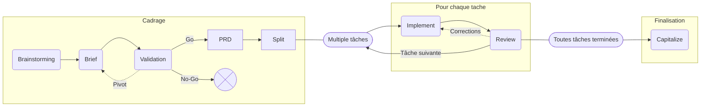

# Workflow AI pour le développement de projets logiciels

Ce projet est un **AI Coding Workflow** léger et modulaire, qui permet d’assister le développement d’un projet logiciel de l'exploration d'idées jusqu'à la validation du code livré. Il s'appuie sur des **agent skills** et une **mémoire sous forme de fichiers Markdown** qui cohabitent avec la documentation du projet.

Le workflow est basé sur le principe de **Spec-Driven Development** mais en version simplifié, humain-au-centre, sans boucles complexes.

Il est conçu pour être utilisé par un développeur solo ou une petite équipe, assisté par un agent IA (OpenCode, Claude Code, Cursor, etc.).

---

## Principes du workflow

- **Spec-Driven / Spec-First :** on cadre et on planifie avant de coder. On ne code pas tant que la tâche n'est pas claire.
- **Human in the loop :** le dev contrôle chaque étape. Pas d'automatisation obligatoire, pas de boucle autonome. Le dev valide explicitement avant de passer à l'étape suivante.
- **Docs as memory :** la doc markdown du projet (`docs/`) est la mémoire du workflow, on ne se base pas  sur l’historique du chat. Cela évite les répétition et le débordement de contexte et permet de reprendre le travail dans une nouvelle session sans perte de contexte.
- **One Skill per Step :** chaque étape est un skill autonome, portable et modulaire.
- **Modulaire et flexible :** on peut entrer dans le workflow à n'importe quelle étape. Chaque skill est utilisable indépendamment. Le niveau de détail s’adapte au contexte : greenfield, grosse feature, micro-feature.
- **Fast-path possible :** pour un fix ou une petite feature, `spec → implement` peut suffire.
- **Tranche verticale :** on livre des incréments petits et complets plutôt qu'un gros chantier monolithique.
- **Volontairement simple :** pas de boucle complexe, pas d'orchestration, pas de scripts obligatoires. Un livrable concret par étape.

---

## Pattern universel de chaque étape

1. Le dev **lance un skill**
2. L'agent lit les **documents d'entrée** ou les **instructions**
3. L'agent réfléchit, pose des questions si nécessaire
4. L'agent produit **un livrable** (Markdown ou code)
5. Le dev relit, corrige, tranche les décisions
6. Le livrable validé devient l'entrée de l'étape suivante

---

## Gate humain systématique

Le dev doit valider explicitement à chaque étape :

- **Clarté :** est-ce que l’output est compréhensible sans relire tout l’historique du chat ?
- **Justesse :** est-ce conforme à l’intention ?
- **Scope :** est-ce bien limité, rien de superflu ?
- **Décisions :** les arbitrages importants sont-ils explicites ?
- **Go/No-Go :** cet output peut-il devenir l’entrée officielle de l’étape suivante ?

---

## Vue d’ensemble du workflow



> `[...]` = étape optionnelle · `4. PRD` et `6. Implement` = étapes obligatoires · Flèches pointillées = boucles de retour
>

---

## Exemple de structure d’un repo

```text
/
├─ AGENTS.md
├─ README.md
├─ CONTRIBUTING.md
├─ LICENSE.md
├─ SECURITY.md
├─ CHANGELOG.md
│
├─ docs/
│  ├─ README.md (doc index)
│  ├─ architecture.md
│  ├─ conventions.md
│  ├─ deployments.md
│  ├─ guidelines.md
│  ├─ integrations.md
│  ├─ testing-strategy.md
│  ├─ release-process.md
│  ├─ ... all other engineering documentation
│  │
│  ├─ decisions/ (ADR)
│  │  ├─ 0001-typescript-only.md
│  │  ├─ 0002-native-esm.md
│  │  └─ 0003-monitoring.md
│  │
│  ├─ product/
│  │  └─ roadmap.md
│  │
│  └─ specs/
│     ├─ 001-<initiative-a>/ (ex: mvp, v1)
│     │  ├─ brainstorming.md
│     │  ├─ brief.md
│     │  ├─ validation.md
│     │  ├─ prd.md
│     │  └─ tasks/
│     │     ├─ 001-init-api.md
│     │     ├─ 002-init-frontend.md
│     │     ├─ 003-init-database-and-models.md
│     │     ├─ 004-authentication.md
│     │     └─ ...
│     │
│     ├─ 002-<initiative-b>/ (ex: dark-mode)
│     │  └─ prd.md
│     │
│     └─ 003-<initiative-C>/ (ex: team-collaboration)
│        ├─ prd.md
│        └─ tasks/
│           ├─ 001-invitations.md
│           └─ 002-permissions.md
│
├─ apps/
│  ├─ web-app/
│  │  ├─ AGENTS.md
│  │  └─ README.md
│  │
│  ├─ mobile-app/
│  │  ├─ AGENTS.md
│  │  └─ README.md
│  │
│  └─ docs/
│     ├─ AGENTS.md
│     ├─ README.md
│     │
│     └─ content/
│        ├─ getting-started/
│        ├─ tutorial/
│        └─ reference/
│
├─ packages/
│  ├─ cli/
│  │  ├─ AGENTS.md
│  │  └─ README.md
│  │
│  └─ ui/
│     ├─ AGENTS.md
│     └─ README.md
│
└─ scripts/
```

### Règles

- **Toujours un dossier par initiative**, même pour une petite feature. La cohérence prime.
- **Le nom du dossier** est descriptif, en kebab-case, sans numéro de séquence.
- **Les fichiers de tâches** sont préfixés par un numéro d'ordre (`001-`, `002-`).
- **Le dossier `tasks/`** n'est créé que si le PRD contient plusieurs tâches.
- **Brief et validation sont supprimables** une fois le PRD créé — le dev décide.
- **`current-state.md`** est au niveau de `docs/specs/`, pas dans un dossier d'initiative (il n'est lié à aucune initiative spécifique).

### Ce qu'on ne crée PAS

- Pas de `feature-map.md` — la liste de tâches est dans le PRD
- Pas de `architecture.md` séparé — les décisions techniques sont dans le PRD
- Pas de `plan.md` — le plan reste dans le contexte de la session d'implémentation
- Pas de `validation-report.md` post-implémentation — le feedback de review est appliqué directement
- Pas de fichiers vides "au cas où"

---

## La mémoire par couche (`docs/`)

- **Mémoire projet :** très durable, peu évolutive, centrée projet et engineering, source de vérité absolue
  - `docs/architecture.md`, `docs/conventions.md`, `docs/decisions/**`, etc.
- **Mémoire produit :** durable, peu évolutive et centrée produit
  - `docs/product/**`
- **Mémoire specs :** moins durable, très évolutive, centrée features
  - `docs/specs/**`

| Couche | Fichiers | Durabilité | Évolution |
| --- | --- | --- | --- |
| **Projet** | `architecture.md`, `conventions.md`, `decisions/` | Permanente | Rare |
| **Produit** | `product/roadmap.md` | Longue durée | Assez rare |
| **Specs** | `specs/NNN-initiative/prd.md`, `specs/NNN-initiative/tasks/NNN-task.md` | Par initiative / feature | Fréquente |

---

## Entrées dans le workflow selon l'intention

Le workflow n'est pas linéaire. On entre à l'étape qui correspond au contexte.

| Intention | Chemin |
| --- | --- |
| **Gros projet / MVP from scratch** | [brainstorm] → brief → validation → PRD → decompose → per-task(implement → [review]) → [capitalize] |
| **Grosse feature sur projet existant** | PRD → decompose → per-task(implement → [review]) |
| **Feature moyenne multi-tâches** | PRD → decompose → per-task(implement → [review]) |
| **Petite feature (1 tâche)** | PRD (léger, agit comme spec) → implement → [review] |
| **Fix / changement trivial** | implement |
| **Exploration d'idées** | brainstorm |
| **Audit d'un repo legacy** | capture current state |

---

## Les étapes

---

### Étape 0 — Capture Current State

**Skill :** `capture-current-state`

**But :** Cartographier l'état actuel d'un projet existant peu ou mal documenté, afin d'établir une baseline fiable avant tout travail.

**Quand l'utiliser :** Onboarding sur un projet legacy, reprise d'un repo abandonné ou mal documenté, audit technique. Cette étape est totalement isolée du reste du workflow — c'est un utilitaire.

**Inputs :** Codebase, README existant, configuration, infra visible, tout ce qui est disponible dans le repo.

**Actions de l'agent :**

- Explore la codebase et la configuration
- Identifie l'architecture en place, les composants principaux, la stack
- Repère les conventions (explicites ou implicites)
- Signale les zones à risque, la dette technique visible, les incohérences
- Identifie les docs manquantes et les trous de connaissance
- Liste les hypothèses et les inconnues
- Pose des questions au dev si certains choix ou zones du code sont incompréhensibles

**Rôle humain :** Répond aux questions de l'agent. Corrige les erreurs factuelles dans l'output. Valide ce qui devient "source of truth".

**Output :** `docs/specs/current-state.md`

**Contenu de l'output :**

- Architecture observée
- Composants principaux et leurs responsabilités
- Stack et dépendances
- Conventions implicites ou explicites
- Zones à risque et dette technique
- Documentation manquante
- Hypothèses et inconnues

**Gate humain :** Relire et corriger. Ce document servira de référence pour le reste du travail sur ce projet.

**Pourquoi cette étape existe :** Un agent IA qui travaille sur un projet qu'il ne comprend pas produit du code incohérent avec l'existant. Cette étape est rare mais critique quand elle est nécessaire.

---

### Étape 1 — Brainstorming / Exploration

**Skill :** `brainstorming`

**But :** Explorer largement un espace d'idées autour d'un sujet donné. La session peut durer 30 à 60 minutes. L'objectif est de générer et structurer un maximum d'idées, pas de converger.

**Quand l'utiliser :** Nouveau produit, nouvelle direction, besoin flou, envie d'explorer avant de cadrer. Fonctionne pour un projet entier comme pour une feature — le but est de trouver des idées autour d'un sujet.

**Inputs :** Prompt libre, notes, brouillon, transcript vocal, intuition, données existantes, directions à explorer.

**Actions de l'agent :**

- Pose des questions ouvertes pour stimuler la réflexion
- Génère des pistes et des alternatives
- Ouvre des angles morts
- Identifie des problèmes, des utilisateurs, des opportunités, des contraintes
- Contrôle la divergence : recentre si la discussion s'éparpille trop
- Met à jour le document de brainstorming à chaque nouvelle idée
- Structure les idées en catégories au fur et à mesure
- Continue tant que le dev ne stoppe pas la session
- Fait une synthèse dans l’output markdown à la fin de la session

**Rôle humain :** Répond aux questions, partage ses idées brutes, oriente les directions d'exploration, peut relancer sur de nouvelles pistes, décide quand stopper la session.

**Output :** `docs/specs/<initiative>/brainstorming.md`

**Contenu de l'output :** Liste structurée d'idées brutes, organisée en catégories pertinentes selon le sujet. Peut inclure : opportunités, problèmes identifiés, personas/cibles, options de solution, cas d'usage, propositions de valeur, risques, hypothèses, contraintes, idées de features, scope initial et futur, questions ouvertes. On liste **tout** ce qui a été évoqué pendant la session de brainstorming.

**Session :** Dédiée. Le brainstorming est long et divergent, il mérite sa propre session.

**Gate humain avant l’étape suivante :** Trier les idées, éliminer les pistes faibles, garder le pertinent. Le dev décide ensuite quoi faire de ces idées : les utiliser comme input pour un brief, pour un PRD, ou simplement les garder comme référence.

**Pourquoi cette étape existe :** Certains projets commencent avec une idée floue. Forcer un cadrage immédiat sans exploration produit des specs superficielles. C'est le seul moment explicitement divergent du workflow.

---

### Étape 2 — Brief

**Skill :** `brief`

**But :** Passer d'une idée (même vague) à un cadrage produit clair et non technique. C'est un document léger et jetable.

**Quand l'utiliser :** C’est le point d’entrée avant d'investir dans un PRD. — *Généralement couplée avec l’étape validation : on utilise les deux ou aucune. Si l’idée est déjà clair et ne nécessite pas de validation, on commence directement au PRD.*

**Inputs :** Brainstorming (si existant), prompt libre, notes, idée brute du dev.

**Actions de l'agent :**

- Fait converger les idées en un cadrage net
- Clarifie le problème et l'utilisateur cible
- Explicite la proposition de valeur
- Décrit la solution envisagée (grandes lignes, non technique)
- Fixe le périmètre et les non-goals
- Identifie les hypothèses et risques principaux
- Pose des questions si des éléments critiques manquent pour cadrer

**Questions que l'agent peut poser si info manquante :**

- Quel problème essaie-t-on de résoudre ?
- Qui en souffre et pourquoi c'est important ?
- Quelle est la solution envisagée (même grossière) ?
- Qu'est-ce qui est explicitement hors scope ?
- Quelles sont les contraintes connues ?

**Rôle humain :** Répond aux questions, valide les arbitrages, tranche les ambiguïtés.

**Output :** `docs/specs/<initiative>/brief.md`

**Contenu de l'output :**

- Problème à résoudre
- Utilisateur cible
- Proposition de valeur
- Solution envisagée (grandes lignes)
- Cas d'usage principaux
- Périmètre (in-scope / out-of-scope)
- Non-goals
- Hypothèses
- Risques connus
- Contraintes connues
- Critères de succès
- Questions ouvertes

**Session :** Dédiée (ou enchaîner après le brainstorming si la session est encore fraîche).

**Gate humain avant l’étape suivante :** Vérifier que le problème et le scope sont nets. Le brief doit être suffisamment clair pour qu'un agent puisse faire une analyse de validation avec.

**Pourquoi cette étape existe :** Le brief protège contre le gaspillage. Il coûte 15 minutes. Si l’étape de validation dit "no-go", on n'a perdu que le brief au lieu d'un PRD complet. Si elle dit "pivot", on ajuste le brief (léger) plutôt qu'un PRD entier.

---

### Étape 3 — Validation

**Skill :** `validate`

**But :** Réduire l'incertitude avant d'investir dans un PRD. L'agent fait des recherches approfondies et produit un avis argumenté avec un verdict Go / No-Go / Pivot.

**Quand l'utiliser :** Quand il y a un doute significatif sur le marché, la concurrence, la faisabilité technique, le business model, ou que le choix produit est risqué. — *Généralement couplée avec l’étape validation : on utilise les deux ou aucune. Si l’idée est déjà clair et ne nécessite pas de validation, on commence directement au PRD.*

**Inputs :** `brief.md`

**Actions de l'agent :**

- Fait des recherches web approfondies
- Analyse le marché et la concurrence
- Évalue les alternatives existantes
- Vérifie la faisabilité technique
- Challenge les hypothèses du brief
- Évalue le business model (si applicable)
- Identifie les contraintes externes et les dépendances
- Produit un verdict argumenté : Go / No-Go / Pivot
- Pose des questions au dev si des éléments sont nécessaires pour l'analyse

**Rôle humain :** Répond aux questions de l'agent si besoin. Lit le rapport de validation. Prend la décision finale.

**Output :** `docs/specs/<initiative>/validation.md`

**Contenu de l'output :**

- Analyse du marché et de la concurrence
- Alternatives existantes
- Risques marché
- Risques techniques
- Faisabilité
- Analyse du business model (si applicable)
- Dépendances externes
- Hypothèses validées / invalidées
- Niveau de confiance global
- Recommandations
- Verdict : Go / No-Go / Pivot (avec justification)

**Session :** Dédiée (recherche web intensive, peut être long).

**Gate humain avant l’étape suivante :** Le dev décide :

- **Go** → passer au PRD
- **Pivot** → réviser le brief et re-valider, ou passer au PRD avec une direction ajustée
- **No-Go** → abandonner l'initiative

**Pourquoi cette étape existe :** Investir des semaines de développement sur une idée non validée est un risque majeur. Cette étape est le filet de sécurité. Elle coûte une session d'agent et peut éviter des semaines de travail inutile.

---

### Étape 4 — PRD

**Skill :** `prd`

**But :** Créer le document de référence central qui décrit **ce qu'on construit** (produit) et **comment on le construit** (technique). Le PRD est la source de vérité pour toute la suite du workflow. Une fois le PRD créé, les fichiers de brief et de validation peuvent être supprimés.

Ce skill s'adapte au scope :

- Pour un projet/MVP/grosse feature multi-tâches : PRD complet avec toutes les sections
- Pour une petite feature (1 tâche) : PRD léger qui agit comme une spec de tâche

**Quand l'utiliser :** Avant toute implémentation qui nécessite du cadrage. C'est le **point d'entrée principal** du workflow pour la majorité des cas.

**Inputs :**

- `brief.md` + `validation.md` (si existants)
- Ou prompt libre / notes du dev (si on entre directement au PRD)
- `current-state.md` (si existant et pertinent)
- Codebase existante pour contexte technique

**Actions de l'agent :**

- Formalise les exigences produit : comportements attendus, user journeys, règles métier, edge cases
- Fixe les critères d'acceptation globaux
- Définit le scope (in-scope / out-of-scope / futur)
- Prend les décisions techniques : architecture, stack, patterns, data model, contraintes
- Pour les scopes larges (≥ ~10 tâches estimées) : organise le travail en **modules** cohérents — blocs fonctionnels indépendants avec leur scope, leurs dépendances et leur ordre
- Produit une liste de tâches légère (noms + statut) — le détail est dans les specs générées par `decompose`
- Pose des questions au dev si des comportements sont ambigus ou si des décisions techniques nécessitent un arbitrage

**Questions que l'agent peut poser si info manquante :**

- Quel est le comportement attendu dans [cas limite] ?
- Quelles sont les permissions / rôles impliqués ?
- Y a-t-il des contraintes de données ou de migration ?
- Y a-t-il des préférences de stack, de librairies, ou de patterns ?
- Quelles fonctionnalités sont MVP vs futures ?
- Quel est l'ordre de priorité entre les tâches ?

**Rôle humain :** Répond aux questions, arbitre les priorités, valide le scope, tranche les comportements ambigus et les choix techniques.

**Output :** `docs/specs/<initiative>/prd.md`

**Contenu de l'output :**

*Partie Produit :*

- Problème et objectifs
- Utilisateur cible / personas
- Proposition de valeur
- User journeys (flux narratifs haut niveau — pas de user stories, celles-ci sont dans les specs de tâches)
- Exigences fonctionnelles
- Exigences non-fonctionnelles
- Règles métier
- Edge cases importants
- Critères d'acceptation globaux
- Scope (in-scope / out-of-scope / futur)
- Non-goals

*Partie Technique :*

- Architecture cible
- Stack et librairies
- Patterns et conventions
- Data model (si pertinent)
- Décisions techniques et justifications
- Contraintes techniques
- Migrations / refactors nécessaires (si applicable)

*Partie Modules (si scope large, ≥ ~10 tâches) :*

Liste des modules avec leur scope et leurs dépendances. Exemple :

- **Module Core** — setup, infra, database (prérequis pour tout)
- **Module Auth** — inscription, login (dépend de Core)
- **Module Frontend** — design system, UI (dépend de Auth)
- **Module Billing** — paiement, plans (dépend de Auth)

*Partie Tâches :*

Liste légère — noms et statut uniquement. Le détail (AC, edge cases, approche technique, user stories) est dans les fichiers de spec générés par `decompose`. Les checkboxes servent de suivi d'avancement.

```markdown
- [ ] 001 — project-setup
- [ ] 002 — database-models
- [ ] 003 — api-base
- [ ] 004 — auth-registration
- [ ] 005 — auth-login
- [ ] 006 — frontend-design-system
```

- Definition of Done globale

**Session :** Dédiée.

**Gate humain avant l’étape suivante :** Valider les exigences, les choix techniques, le scope et la liste de tâches. Le PRD devient la source de vérité. Les fichiers de brief et validation peuvent être supprimés si le dev le souhaite.

**Pourquoi cette étape existe :** Le PRD est le pivot du workflow. Il transforme une idée cadrée en un plan constructible. En intégrant les décisions techniques directement dans le PRD, on évite une étape d'architecture séparée et on produit un document autosuffisant pour le découpage en tâches.

---

### Étape 5 — Decompose

**Skill :** `decompose`

**But :** Créer toutes les specs de tâches d'un coup à partir du PRD. Chaque tâche du PRD reçoit son propre fichier de spec avec suffisamment de détail pour être implémentée indépendamment.

**Quand l'utiliser :** Quand le PRD contient plusieurs tâches à implémenter. **Ne pas utiliser** si le PRD est un PRD léger single-task (dans ce cas, le PRD fait office de spec et on passe directement à l'implémentation).

**Inputs :** `prd.md`

**Actions de l'agent :**

- Lit le PRD, la liste de tâches et les modules (si présents)
- Pour chaque tâche, crée un fichier de spec contenant les détails d'implémentation
- Si le PRD utilise des modules : génère les tâches en respectant l'ordre inter-modules et les dépendances ; reflète l'appartenance au module dans le nom de fichier (ex: `003-core-api-base.md`, `006-frontend-design-system.md`)
- S'assure que chaque spec est auto-suffisante (compréhensible sans relire tout le PRD, mais peut y faire référence)
- Maintient la cohérence entre les specs (pas de contradictions)
- S'assure que les dépendances entre tâches sont explicites
- Pose des questions si certaines tâches sont ambiguës

**Rôle humain :** Relit les specs générées, ajuste si nécessaire, réordonne si besoin.

**Output :** Un fichier par tâche dans `docs/specs/<initiative>/tasks/`

Nommage : `001-<nom-court>.md`, `002-<nom-court>.md`, etc.
Pour les PRDs avec modules : préfixer le nom avec le module — `003-core-api-base.md`, `006-frontend-design-system.md`.

**Contenu de chaque spec :**

- Contexte (référence au PRD et au module si applicable)
- Objectif de la tâche
- User stories (format : *En tant que X, quand Y, je peux Z*)
- Comportement attendu détaillé
- Edge cases et règles métier spécifiques à cette tâche
- Approche technique sommaire (fichiers impactés, patterns à suivre)
- Critères d'acceptation testables
- Tests à couvrir
- In-scope / out-of-scope de cette tâche
- Dépendances (tâches qui doivent être faites avant)
- Definition of Done

**Session :** Dédiée (une seule invocation produit toutes les specs).

**Gate humain avant l’étape suivante :** Relire les specs, ajuster, réordonner. Choisir la première tâche à implémenter.

**Pourquoi cette étape existe :** Créer les specs une par une en invoquant un skill 20 fois est fastidieux. Un seul passage sur le PRD produit un ensemble cohérent de specs, avec des dépendances claires et sans contradictions. Les specs sont modérément détaillées — le complément se fait au moment de l'implémentation quand l'agent a accès au code réel.

---

### Étape 6 — Implement

**Skill :** `implement`

**But :** Planifier puis implémenter une tâche. Ce skill a deux phases (plan et build) qui se déroulent dans la même session. Le comportement dépend du mode de l'agent :

- **Mode PLAN :** l'agent planifie l'implémentation sans toucher au code. Le dev valide le plan, puis switch l'agent en mode BUILD.
- **Mode BUILD :** l'agent implémente directement. Utilisé soit après validation du plan, soit directement pour les tâches simples.

**Quand l'utiliser :** Pour chaque tâche à implémenter. C'est l'étape obligatoire et centrale de la boucle de développement.

**Inputs :**

- La spec de la tâche (`tasks/001-<nom>.md` ou `prd.md` si single-task)
- Le code existant
- Le PRD pour contexte global (si applicable)

**Actions de l'agent :**

*En mode PLAN :*

- Lit la spec et explore le code existant
- Identifie les fichiers à créer / modifier
- Ordonne les étapes d'implémentation
- Identifie les points de contrôle
- Signale les risques ou ambiguïtés
- Présente le plan au dev pour validation
- Pose des questions si des choix techniques nécessitent un arbitrage

*En mode BUILD :*

- Implémente en suivant le plan (si plan validé) ou en suivant la spec (si build direct)
- Reste strictement dans le scope de la spec
- Demande confirmation avant toute dérive du scope ou du plan
- Exécute les tests au fur et à mesure
- Vérifie que le build passe
- Fait une auto-review rapide en fin d'implémentation (conformité spec, pas de code mort, pas de TODO oubliés)
- Continue jusqu'à ce que la tâche soit fonctionnelle

**Questions que l'agent peut poser :**

- La spec mentionne X, mais le code existant fait Y — que faire ?
- Ce pattern est-il correct pour ce projet ?
- Le scope doit-il inclure [cas non spécifié] ?

**Rôle humain :**

- En mode PLAN : valide le plan avant le passage en BUILD
- En mode BUILD : répond aux questions, donne des instructions pour ajuster si besoin
- Vérifie que le code fonctionne à la fin

**Output :** Code implémenté, tests passants, build fonctionnel.

**Fichier :** Aucun fichier de workflow. Le plan reste dans le contexte de la session. Le livrable est le code.

**Session :** Dédiée par tâche. **Plan et build dans la même session** — ne pas séparer.

**Gate humain avant l’étape suivante :** Vérifier que le code fonctionne. Décider si une review est nécessaire.

**Pourquoi cette étape existe :** C'est le coeur du workflow. La fusion plan + build dans une même session préserve le raisonnement de l'agent. Un agent qui planifie puis implémente dans la foulée produit un code plus cohérent qu'un agent qui reçoit un plan sans comprendre le raisonnement derrière.

---

### Étape 7 — Review

**Skill :** `review`

**But :** Vérifier la qualité du code et la conformité à la spec avec un regard frais. Couvre à la fois la review de code et la validation fonctionnelle.

**Quand l'utiliser :** Au jugement du dev. Recommandé quand la tâche est conséquente (plus de 2 fichiers modifiés, logique métier complexe, changement d'architecture). Peut être sauté pour les fixes mineurs ou changements cosmétiques.

**Inputs :** Spec de la tâche, diff du code ou état courant du code modifié.

**Actions de l'agent :**

- Compare l'implémentation aux critères d'acceptation de la spec
- Identifie les écarts, les oublis, les comportements non spécifiés
- Vérifie la qualité du code : lisibilité, patterns, sécurité, performance
- Vérifie que les tests couvrent les cas définis dans la spec
- Cherche les bugs potentiels et les risques de régression
- Produit un verdict : accepté / à corriger (avec liste précise)
- Prépare une checklist de QA manuelle pour le dev si applicable

**Rôle humain :** Lit le feedback, décide des corrections à appliquer, fait la QA manuelle si nécessaire.

**Output :** Feedback structuré dans le contexte de la session : verdict, problèmes classés par sévérité, suggestions, checklist QA si applicable.

**Fichier :** Non en règle générale. Le feedback est appliqué immédiatement. Pour une tâche critique ou réglementée, le dev peut demander un fichier de review.

**Session :** **Nouvelle session, avec un modèle différent si possible.** C'est le seul moment du workflow où le changement de modèle est explicitement recommandé. Un agent qui review son propre code a un biais de confirmation.

**Gate humain avant l’étape suivante :** Si corrections nécessaires → retour à l'étape 6 (implement) pour appliquer les corrections. Sinon → tâche terminée.

**Pourquoi cette étape existe :** Un regard frais attrape des problèmes que l'implémenteur ne voit pas. Le changement de modèle/session élimine le biais de confirmation et apporte une perspective différente sur le code.

---

### Étape 8 — Capitalize

**Skill :** `capitalize`

**But :** Mettre à jour la documentation existante du projet pour refléter ce qui a été implémenté. Ce n'est pas "créer de la doc" mais "maintenir la doc à jour".

**Quand l'utiliser :** Après une implémentation qui a modifié quelque chose de documenté ailleurs : architecture, API, conventions, README, [AGENTS.md](http://agents.md/), etc. Ne pas utiliser après chaque micro-tâche — seulement quand quelque chose de documenté a changé.

**Inputs :** Code implémenté, documentation existante du projet.

**Actions de l'agent :**

- Identifie les documents qui ne sont plus à jour par rapport au code
- Met à jour les documents concernés (README, [AGENTS.md](http://agents.md/), docs d'architecture, docs d'API, etc.)
- Ne crée pas de nouveaux documents sauf si explicitement demandé
- Signale au dev les documents mis à jour

**Rôle humain :** Valide les mises à jour.

**Output :** Documents existants mis à jour.

**Fichier :** Pas de nouveau fichier. Mise à jour de fichiers existants.

**Session :** Libre (peut être dans la session de review ou une session dédiée).

**Gate humain avant l’étape suivante :** Vérifier que les mises à jour sont correctes.

**Pourquoi cette étape existe :** La documentation qui diverge du code est pire qu'une absence de documentation — elle induit en erreur. Cette étape est le filet de sécurité contre la dérive documentation/code.

---

## Use cases et gestion des situations courantes

### Quand modifier un PRD existant

**On modifie le PRD en cours quand** le changement affecte le scope ou les exigences de l'initiative sans en changer la nature : découverte technique, tâche à splitter, repriorisation, ajout dans le scope alors que l'initiative n'est pas terminée.

**On ne modifie jamais** un PRD dont toutes les tâches sont terminées — il devient un document historique. Tout nouveau travail = nouvelle initiative.

**On ne modifie pas** les task specs des tâches déjà implémentées. Si le comportement doit changer, c'est une nouvelle tâche.

| Situation | Modifier PRD | Modifier task spec | Nouvelle initiative |
| --- | :-: | :-: | :-: |
| Découverte technique qui change les contraintes | Oui | Oui (tâches à venir) | — |
| Tâche trop grosse à splitter | Oui (task list) | Remplacer par N specs | — |
| Repriorisation suite à feedback | Oui | Oui si ajout/retrait | — |
| Ajout de scope lié, initiative en cours | Oui | Oui | — |
| Nouvelle feature indépendante | — | — | Oui |
| Pivot fondamental | Statut final + note | — | Oui |
| Initiative terminée, nouveau bloc de travail | — | — | Oui |

---

### Use cases

---

#### 1. Feature simple (1 tâche)

**Contexte :** MVP livré, on veut ajouter le dark mode.

**Chemin :** `PRD léger → implement → [review]`

```text
docs/specs/004-dark-mode/
  prd.md    ← agit comme spec, pas de dossier tasks/
```

Pas de decompose. Pas de modification des initiatives précédentes. Le roadmap peut être mis à jour.

---

#### 2. Grosse feature (multi-tâches, < ~10 tâches)

**Contexte :** MVP livré, on veut ajouter un système de collaboration d'équipe.

**Chemin :** `PRD → decompose → per-task(implement → [review]) → capitalize`

```text
docs/specs/005-team-collaboration/
  prd.md
  tasks/
    001-data-model-teams.md
    002-invitation-system.md
    003-permissions.md
    004-shared-spaces.md
```

Le PRD couvre tout le scope de la feature sans section modules — la liste de tâches suffit. Le capitalize en fin d'initiative met à jour les docs techniques si l'architecture a évolué.

---

#### 3. Gros projet / MVP (≥ ~10 tâches, avec modules)

**Contexte :** Nouveau produit from scratch. Après brainstorming → brief → validation, on a une direction claire mais ~25 tâches à implémenter.

**Chemin :** `PRD (avec modules) → decompose → per-task(implement → [review]) → capitalize`

Le PRD est **une seule initiative** avec une section modules. Pas de PRD séparé par module.

```text
docs/specs/001-mvp/
  brainstorming.md
  brief.md
  validation.md
  prd.md              ← un seul PRD, 4 modules, ~25 tâches en checklist
  tasks/
    001-core-project-setup.md
    002-core-database-models.md
    003-core-api-base.md
    004-auth-registration.md
    005-auth-login.md
    006-auth-email-verification.md
    007-frontend-design-system.md
    008-frontend-landing.md
    009-frontend-dashboard.md
    010-billing-stripe-integration.md
    ...
```

La section modules du PRD ressemble à :

```markdown
## Modules

- **Core** — setup, infra, database (tâches 001-003, prérequis pour tout)
- **Auth** — inscription, login, vérification email (tâches 004-006, dépend de Core)
- **Frontend** — design system, landing, dashboard (tâches 007-009, dépend de Auth)
- **Billing** — Stripe, plans, facturation (tâches 010-..., dépend de Auth)
```

Le decompose s'exécute en une seule passe sur le PRD entier et génère toutes les specs avec les préfixes de module dans les noms de fichiers. On implémente ensuite module par module dans l'ordre des dépendances.

---

#### 4. Discovery technique en cours d'implémentation

**Contexte :** On implémente la tâche 005 (Stripe) et on découvre que Stripe ne supporte pas les abonnements multi-devises. Les tâches 008 et 012 sont impactées.

**Ce qu'on fait :**

- Terminer la tâche 005 normalement
- Mettre à jour le PRD : section technique, noter la contrainte et la décision prise
- Mettre à jour les task specs 008 et 012 avant de les implémenter
- Ne pas toucher aux specs des tâches déjà implémentées

**Règle :** on met à jour entre deux tâches, pas "plus tard". L'agent qui lira la spec obsolète dans 3 jours produira du code incompatible.

---

#### 5. Pivot après plusieurs semaines de dev

**Contexte :** MVP en cours (8/15 tâches terminées). Les retours utilisateurs imposent un changement de direction produit significatif.

**Ce qu'on fait :**

- Stopper l'implémentation du MVP actuel
- Annoter le PRD en cours : marquer les tâches terminées/abandonnées, ajouter une note "Initiative interrompue — pivot vers [nouvelle direction]"
- Créer une nouvelle initiative : `docs/specs/002-nouvelle-direction/`
- Si incertitude forte : `brief → validation → PRD`. Si direction claire : `PRD` directement
- Dans le nouveau PRD, identifier ce qui peut être réutilisé du MVP
- Mettre à jour le roadmap

L'ancien PRD reste intact comme mémoire historique. On ne le réécrit pas.

---

#### 6. Tâche trop grosse découverte au moment du plan

**Contexte :** En mode PLAN sur `003-permissions.md`, on réalise que ça implique un système de rôles, un middleware, une UI admin et des migrations. La spec prévoyait une seule tâche.

**Ce qu'on fait :**

- Ne pas implémenter en une seule session
- Modifier le PRD : splitter la tâche dans la task list, ajuster l'ordre et les dépendances
- Remplacer la task spec par N specs :

```text
tasks/
  003-role-model.md
  004-auth-middleware.md
  005-admin-ui.md
  006-data-migration.md
  007-...  ← anciennes tâches renumérotées
```

Le split peut se faire manuellement ou via un `decompose` partiel sur les tâches concernées.

---

#### 7. Bug / hotfix

**Contexte :** Bug critique en production — les emails avec `+` sont rejetés au login.

**Chemin :** `implement` directement, pas de PRD ni de spec.

Le prompt au skill fait office de spec : description du bug, comportement attendu, comportement observé. Review recommandée si le fix touche à de la logique sensible (auth, paiement).

Si le bug révèle un problème plus large (toute la validation email est cassée), ça devient une petite feature : nouvelle initiative avec PRD léger.

---

#### 8. Repriorisation suite à feedback utilisateur

**Contexte :** À la tâche 6/12 du MVP. Les beta-testeurs veulent l'export PDF (prévu en phase 2). Les notifications (tâche 10) n'intéressent personne.

**Ce qu'on fait :**

- Modifier le PRD : ajouter "export PDF" dans la task list, déplacer "notifications" dans "Future / Out of scope", ajouter une note de décision
- Créer la task spec `013-export-pdf.md`
- Annoter `010-notifications.md` : "ANNULÉE — reportée post-MVP"
- Continuer dans le nouvel ordre

---

#### 9. Refactoring / dette technique

**Contexte :** Après plusieurs initiatives, la couche API est incohérente, le code est dupliqué, les tests sont fragiles.

**Chemin :** `PRD technique → decompose → per-task(implement → review) → capitalize`

```text
docs/specs/006-api-refactoring/
  prd.md    ← pas de partie produit, que du technique
  tasks/
    001-api-consistency.md
    002-remove-duplication.md
    003-test-stability.md
```

Le PRD technique contient : état actuel (problèmes), état cible, approche, risques de régression. Review fortement recommandée. Capitalize met à jour `docs/architecture.md` et `docs/conventions.md`.

Ne pas glisser du refactoring dans une initiative produit en cours — ça pollue le scope et complexifie la review.

---

#### 10. Tâche implémentée qui invalide des specs à venir

**Contexte :** La tâche `004-real-time-sync.md` adopte WebSockets. La tâche `007-offline-mode.md` partait du principe que tout passait par REST.

**Ce qu'on fait :**

- Terminer la tâche 004
- Immédiatement après : mettre à jour le PRD (section technique, décision WebSocket) et la spec `007-offline-mode.md` (approche technique, critères d'acceptation, edge cases)
- Si l'impact est majeur, splitter la tâche 007 (cf. use case 6)

**Règle :** après chaque implémentation, se demander "est-ce que ça change quelque chose pour les tâches à venir ?". Si oui, mettre à jour avant de passer à la tâche suivante.

---

#### 11. Exploration d'une idée sans engagement

**Contexte :** Intuition pour une feature de gamification, mais on ne sait pas si c'est pertinent ou prioritaire.

**Ce qu'on fait :**

```text
docs/specs/007-gamification/
  brainstorming.md    ← c'est tout pour l'instant
```

Si on veut aller plus loin : `brief → validation → PRD`. Si non, le dossier reste en veille avec juste le brainstorming. C'est une trace des idées explorées — si on y revient dans 3 mois, on ne repart pas de zéro.

---

## Résumé des skills

| # | Skill | Obligatoire | Produit un fichier | Session dédiée |
| --- | --- | --- | --- | --- |
| 0 | `capture-current-state` | Non (utilitaire) | Oui | Oui |
| 1 | `brainstorm` | Non | Oui | Oui |
| 2 | `brief` | Non (couplé avec validate) | Oui | Oui |
| 3 | `validate` | Non (couplé avec brief) | Oui | Oui |
| 4 | `prd` | Oui (sauf fix trivial) | Oui | Oui |
| 5 | `decompose` | Si multi-tâches | Oui (N fichiers) | Oui |
| 6 | `implement` | Oui | Non (code) | Oui, par tâche |
| 7 | `review` | Recommandé | Non | Oui, autre modèle |
| 8 | `capitalize` | Non | Non (mises à jour) | Libre |
